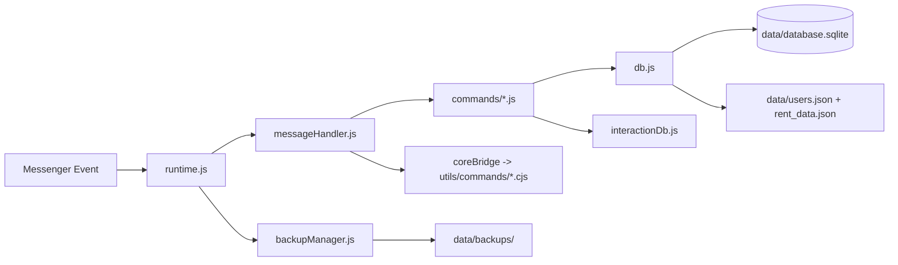

# Bot Messenger (meta-messenger.js)

[](https://nodejs.org/)
[](https://github.com/kha0305/bot-mess)


Bot Messenger chạy bằng `meta-messenger.js`, hỗ trợ command runtime, quản trị nhóm, game/tài chính, media (nhạc/video), AI (text + vision), backup dữ liệu tự động và cơ chế reconnect ổn định.

## Mục lục

- [Tác giả](#tác-giả)
- [Kiến trúc tổng quan](#kiến-trúc-tổng-quan)
- [Tính năng chính](#tính-năng-chính)
- [Yêu cầu hệ thống](#yêu-cầu-hệ-thống)
- [Cài đặt nhanh](#cài-đặt-nhanh)
- [Cấu hình bắt buộc](#cấu-hình-bắt-buộc)
- [Biến môi trường](#biến-môi-trường)
- [Danh sách lệnh](#danh-sách-lệnh)
- [Scripts npm](#scripts-npm)
- [Backup và Restore](#backup-và-restore)
- [Cấu trúc thư mục](#cấu-trúc-thư-mục)
- [Bảo mật và chia sẻ mã nguồn](#bảo-mật-và-chia-sẻ-mã-nguồn)
- [Changelog và release](#changelog-và-release)
- [Nguồn tham khảo](#nguồn-tham-khảo)
- [Ghi chú bản quyền](#ghi-chú-bản-quyền)

## Tác giả

- Tác giả chính: **Bảo Kha**
- GitHub: [kha0305](https://github.com/kha0305)
- Repo chính thức: [https://github.com/kha0305/bot-mess](https://github.com/kha0305/bot-mess)

## Kiến trúc tổng quan



## Tính năng chính

- Framework command ESM (`commands/*.js`) + bridge command legacy CJS (`utils/commands/*.cjs`).
- Hỗ trợ cả luồng thường và E2EE (`message`, `e2eeMessage`, reaction...).
- Auto reconnect với watchdog + retry khi mạng chập chờn.
- Lưu dữ liệu bền với SQLite + JSON mirror.
- Backup dữ liệu theo giờ/ngày và có script restore.
- Tích hợp command AI/vision, tải nhạc/video, game, quản trị nhóm.

## Yêu cầu hệ thống

- Node.js: khuyến nghị **Node 20 LTS**.
- Hệ điều hành: Windows/Linux.
- Internet ổn định để kết nối Messenger và API ngoài.

## Cài đặt nhanh

```bash
npm install
npm start
```

## Cấu hình bắt buộc

Bot cần cookie hợp lệ trong `data/cookies.json`.

Mẫu tối thiểu:

```json
[
  { "name": "c_user", "value": "YOUR_UID", "domain": ".facebook.com", "path": "/" },
  { "name": "xs", "value": "YOUR_XS", "domain": ".facebook.com", "path": "/" }
]
```

Khuyến nghị có thêm `datr`, `fr`, `sb`, `wd` để ổn định hơn.

## Biến môi trường

Bạn có thể cấu hình trực tiếp trên môi trường chạy hoặc qua `.env` (nếu tự nạp).

### Quyền global bot

- `BOT_SUPERADMINS`
- `BOT_ADMINS`
- `BOT_NDH`

Định dạng: danh sách UID ngăn cách bởi dấu phẩy.

### Logging và kết nối

- `BOT_DETAILED_LOG` (mặc định `true`)
- `BOT_TRACE_MAX_TEXT`
- `BOT_LOG_LEVEL` (`trace|debug|info|warn|error|none`, mặc định `error`)
- `BOT_VERBOSE_MESSAGE_LOG`
- `BOT_LOG_RESOLVE_SENDER_NAME`
- `BOT_CONNECT_RETRY_MIN_MS`
- `BOT_CONNECT_RETRY_MAX_MS`
- `BOT_CONNECTION_CHECK_INTERVAL_MS`
- `BOT_DISCONNECT_GRACE_MS`

### Backup dữ liệu

- `DATA_BACKUP_INTERVAL_MS`
- `DATA_BACKUP_KEEP_HOURLY`
- `DATA_BACKUP_KEEP_DAILY`
- `DATA_BACKUP_TZ` (mặc định `Asia/Ho_Chi_Minh`)

### AI và media

- `PICOCLAW_PATH`
- `NOTE_BASE_URL`
- `NOTE_BASE_URLS`
- `NOTE_UPLOAD_TIMEOUT_MS`
- `NOTE_UPLOAD_RETRIES`
- `VIDEO_MAX_BYTES`
- `VIDEO_SEND_RETRIES`
- `VIDEO_SEND_RETRY_DELAY_MS`
- `VIDEO_DEBUG_LOG`
- `SING_DEBUG_LOG`
- `BOT_AUTO_VIDEO_TIMEOUT_MS`
- `BOT_AUTO_VIDEO_MAX_BYTES`

### PayOS (tuỳ chọn)

- `PAYOS_ENABLED`
- `PAYOS_CLIENT_ID`
- `PAYOS_API_KEY`
- `PAYOS_CHECKSUM_KEY`
- `PAYOS_PORT`

### Core sync (legacy)

- `FORCE_SYNC`
- `ALTER_SYNC`
- `FALLBACK_FORCE`
- `CHECKTT_CHART_ENABLED`

## Danh sách lệnh

### Tiện ích / thông tin

`menu`, `help`, `ping`, `info`, `uid`, `math`, `uptime`, `check`, `checkrent`, `bot`, `hi`, `choose`

### Tài chính / game

`balance`, `daily`, `pay`, `vay`, `work`, `cave`, `tx`, `roll`

### Media / nội dung

`sing`, `video`, `pinterest`, `vd`, `gái`, `dhbc`, `dich`, `ai`

### Quản trị nhóm

`add`, `del`, `qtv`, `qtvonly`, `rename`, `autosend`, `setmoney`, `setunsend`, `chuiadmin`, `chuilientuc`, `chuidenchet`, `rentadd`

### Hệ thống / admin

`load`, `reset`, `db`, `ban`, `unban`, `admin`, `note`

## Scripts npm

- `npm start`: chạy bot.
- `npm run backup:data`: backup dữ liệu ngay.
- `npm run restore:data -- <args>`: restore snapshot.
- `npm run test:smoke`: test smoke runtime.
- `npm run test:all`: test syntax/load/contract/smoke.

## Backup và Restore

Tạo backup:

```bash
npm run backup:data
```

Liệt kê snapshot:

```bash
node scripts/restore-backup.js --list
```

Restore:

```bash
node scripts/restore-backup.js latest
node scripts/restore-backup.js hourly 2026-03-17_21
node scripts/restore-backup.js daily 2026-03-17
```

## Cấu trúc thư mục

```text
.
├─ commands/           # Command ESM
├─ services/bot/       # Runtime + event pipeline
├─ utils/              # Helper, bridge, legacy core commands
├─ scripts/            # Backup/restore/test
├─ data/               # Runtime data (ignored trên git)
├─ index.js            # Entry point
├─ config.js           # Prefix + role config
├─ db.js               # SQLite + JSON mirror
└─ interactionDb.js    # Tương tác nhóm
```

## Bảo mật và chia sẻ mã nguồn

Không commit dữ liệu nhạy cảm:

- `data/cookies.json`
- `data/e2ee_device.json`
- `data/database.sqlite*`
- `data/backups/`
- `e2ee_device.json`

Tài liệu share vỏ sạch:

- [HUONG_DAN_SHARE_VO_SACH.md](./HUONG_DAN_SHARE_VO_SACH.md)

## Changelog và release

- Changelog chi tiết: [CHANGELOG.md](./CHANGELOG.md)
- Gợi ý release:
  - `git tag v1.0.0`
  - `git push origin v1.0.0`

## Nguồn tham khảo

- [meta-messenger.js](https://www.npmjs.com/package/meta-messenger.js)
- [yt-dlp-exec](https://www.npmjs.com/package/yt-dlp-exec)
- [ffmpeg-static](https://www.npmjs.com/package/ffmpeg-static)
- [sqlite3](https://www.npmjs.com/package/sqlite3)
- [@payos/node](https://www.npmjs.com/package/@payos/node)

## Ghi chú bản quyền

Mã nguồn thuộc dự án của **Bảo Kha**.  
Khi fork/reuse, vui lòng giữ phần credit tác giả và repo gốc.
